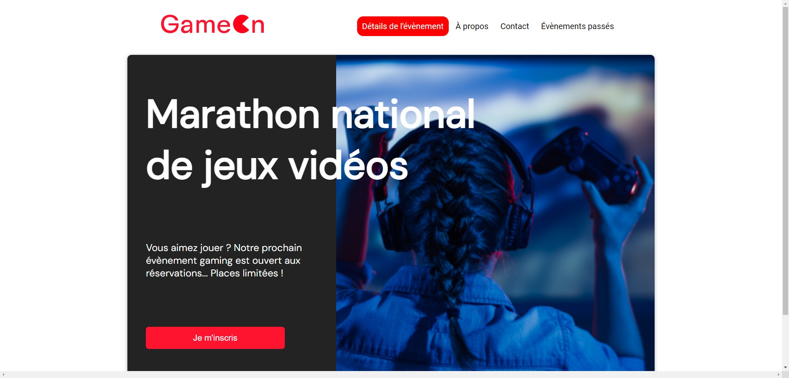

# Projet 4 - GameOn

Quatrième projet de la formation OpenClassrooms : Développeur d'applications Javascript/React.
Objectif : 
- Récupération d'un projet non terminé
- Création du code javascript qui vérifie les données utilisateur entrées dans le formulaire
- Gestion du responsive (Desktop / Tablette / Mobile)

## Installation

La seule librairie intégrée au projet est Font-Awesome, et est importé en CDN.
Pour récupérer le projet, clonez directement ce repository.
Les fichiers CSS et JS sont minifiés pour gagner en temps de chargement et performances utilisateur.

## Demo

